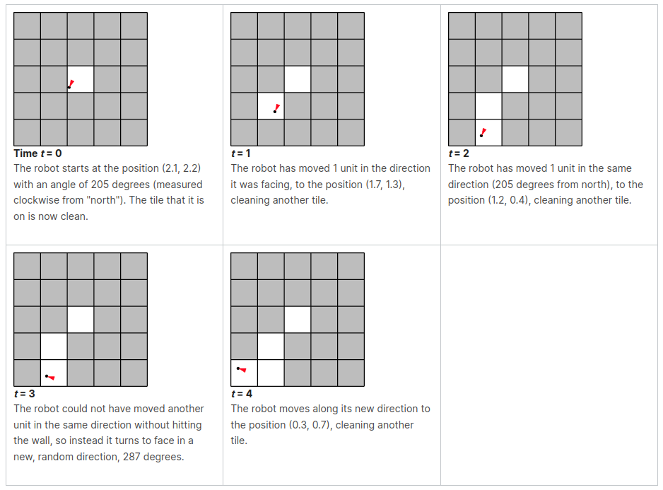
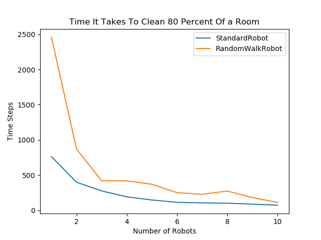
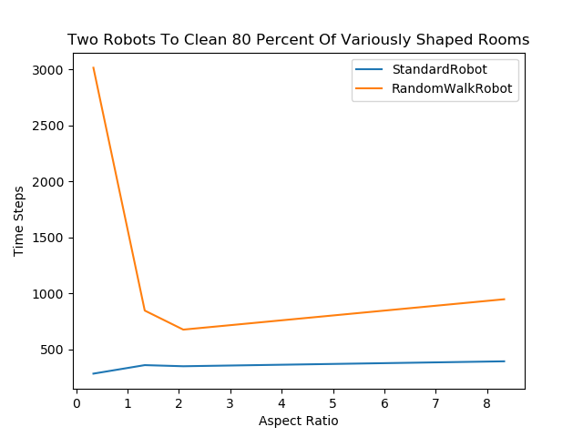

<!-- PROJECT LOGO -->
 

  

<h3 align="center">Roomba Bots</h3>

  

      This project involves coding a simulation of Roomba vacuuming robots under two different
      'cleaning strategies'. 
     
  

<!-- TABLE OF CONTENTS -->

  
Table of Contents

  <ol>
    <li>
      <a href="#about-the-project">About The Project</a>
      <ul>
        <li><a href="#built-with">Built With</a></li>
        <li><a href="#what-i-learned">What I Learned</a></li>
      </ul>
    </li>
    <li><a href="#contributing">Contributing</a></li>
    <li><a href="#license">License</a></li>
    <li><a href="#contact">Contact</a></li>
    <li><a href="#acknowledgments">Acknowledgments</a></li>
  </ol>

<!-- ABOUT THE PROJECT -->
## About The Project

 

This project involves coding a simulation of Roomba vacuuming robots under two different
 'cleaning strategies'. The diagram above describes a simplified simulation of one robot in a 5x5 grid using the 'Standard' cleaning strategy. In this strategy, a robot is assigned a random initial position and direction. The robot maintains it's direction and proceeds to clean subsequent tiles until it encounters a wall. At that point, the direction is randomly changed and the steps are repeated until a specified percentage of the tiles have been cleaned. The second startegy is similar to the first except that a random direction is choosen after each time step as opposed to when a wall is encountered.

The simulations were run with different numbers of robots and with different 'room layouts' to compare the amount of time required to clean a certain percentage of the room. Below are a couple of graphs of the results. 

 

 

 Give it a try for yourself!

### Built With

* [Python](https://www.python.org/)

### What I learned

<ol>
  <li> Object Oriented Programming </li>
  <li> Defining classes and working with class methods </li>
  <li> Stochastic simulations  </li>
  <li> Inheritance </li>
  <li> Using Pylab library </li>
</ol>

(<a href="#top">back to top</a>)

<!-- CONTRIBUTING -->
## Contributing

Anyone who would like to contribute to this project or has suggestions for improvements are welcomed!

(<a href="#top">back to top</a>)

<!-- LICENSE -->
## License

Distributed under the MIT License. See `LICENSE.txt` for more information.

(<a href="#top">back to top</a>)

<!-- CONTACT -->
## Contact

Zac Cooper - [@zwcoop](https://twitter.com/zwcoop) - zwcoop@protonmail.com

Project Link: [https://github.com/zwcoop/Roomba](https://github.com/zwcoop/Roomba)

(<a href="#top">back to top</a>)

<!-- ACKNOWLEDGMENTS -->
## Acknowledgments

This project was done as a part of the MITx 6000.2 course I took through the edX online learning platform. A scaffold of the code was provided to build off of. Any errors are of course my own. A special thanks to the MIT professors below for sharing their knowledge and expertise with the world.

* John Guttag
* Eric Grimson
* Ana Bell

[MIT 6000.1x](https://youtube.com/playlist?list=PLRJdqdXieSHN0U9AdnmwD-9QcR9hmw04d)

[MIT OPENCOURSEWARE](https://ocw.mit.edu/courses/electrical-engineering-and-computer-science/6-0001-introduction-to-computer-science-and-programming-in-python-fall-2016/)

(<a href="#top">back to top</a>)

